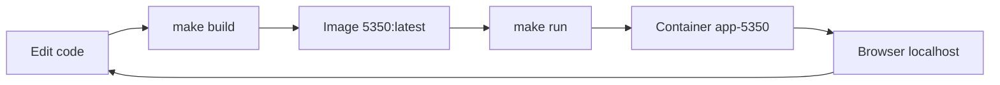
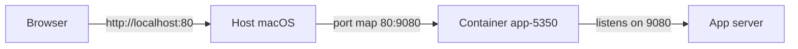
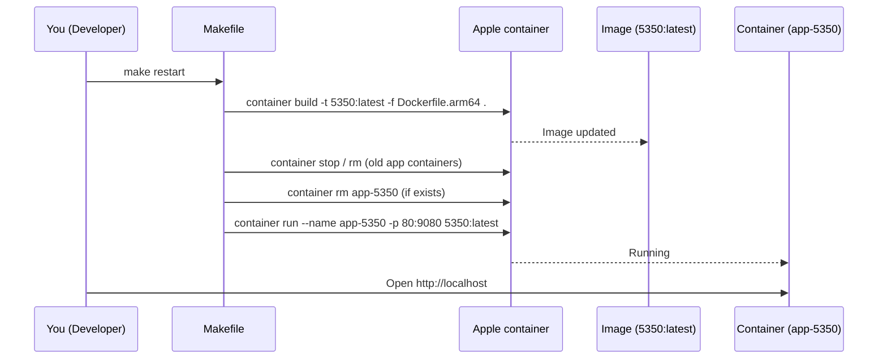
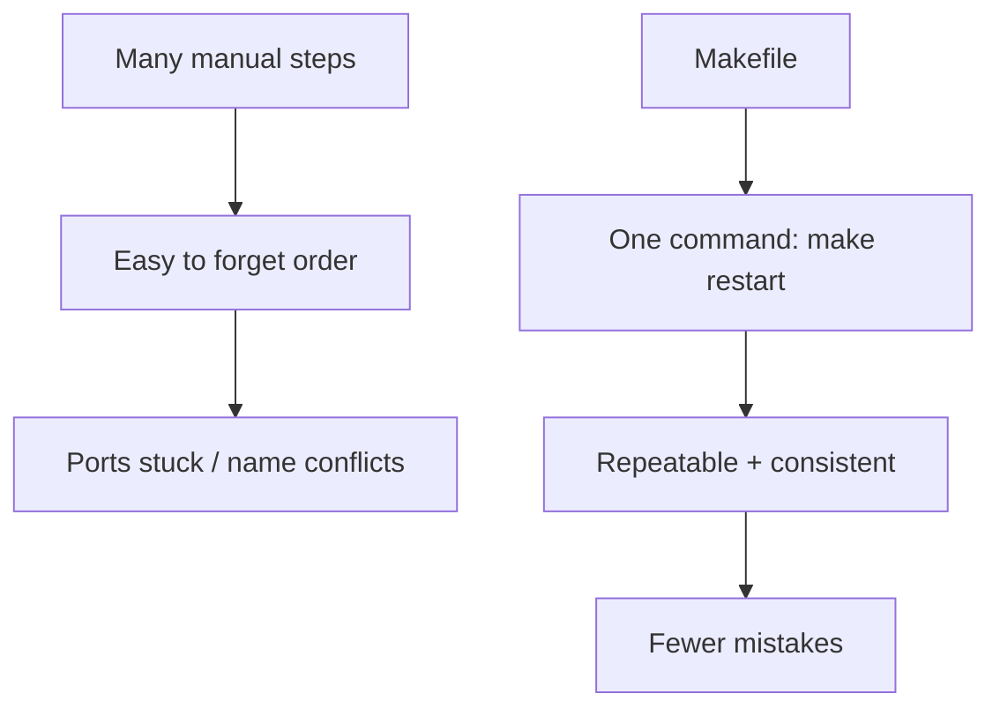

# Local App Development with Apple `container` + Makefile (Student Guide)

Welcome!   
This repo shows how to **build, run, stop, and restart** a local application using:

- **Apple’s `container` CLI** (macOS)
- A **Makefile** to automate common tasks
- An **ARM64 Dockerfile** (for Apple Silicon Macs)

You do **not** need Docker Desktop for this setup.

---

## Big picture



---

## Prerequisites

- macOS (Apple Silicon: M1 / M2 / M3 recommended)
- Apple `container` CLI installed
- Basic terminal usage

Verify:
```bash
container --version
```

---

## Key Concepts (Plain English)

### Image
An **image** is a packaged version of your app (code + runtime).
- Built from `Dockerfile.arm64`
- Named: `5350:latest`

### Container
A **container** is a running instance of an image.
- Named: `app-5350`
- Runs your app and holds resources like ports

### Ports
- **Container port**: where the app listens *inside* the container (e.g., `9080`)
- **Host port**: where you access it on your Mac (e.g., `80`)



---

## Files in this project

| File | Purpose |
|---|---|
| `Dockerfile.arm64` | Defines how the app image is built |
| `Makefile` | Automates build/run/stop tasks |
| `README.md` | You’re reading it |

---

## Daily workflow (the 3 commands)



---

## Common commands

### 1) See what’s running
```bash
make list
```

### 2) Build the app image
```bash
make build
```

### 3) Run the app
```bash
make run
```

Open:
- `http://localhost`

### 4) Stop and remove the app container (free ports)
```bash
make clean
```

### 5) Full reset (recommended)
```bash
make restart
```

---

## Why we use a Makefile

Without a Makefile, you must remember multiple commands and the correct order.
With a Makefile, you get one consistent workflow:



---

## Common errors & fixes

### “Address already in use”
**Meaning:** Something is still using the host port (often your previous container).

Fix:
```bash
make clean
make run
```

### “container with id app-5350 already exists”
**Meaning:** Apple containers won’t reuse the same name unless the old container is removed.

Fix: this repo’s `make run` already removes it first.

---

## Troubleshooting checklist

1. **List running containers**
   ```bash
   make list
   ```
2. **Check who is listening on port 80**
   ```bash
   make portcheck
   ```
3. **Try a full reset**
   ```bash
   make restart
   ```

---

## What to try next

1. Edit some code
2. Run:
   ```bash
   make restart
   ```
3. Refresh your browser
4. Repeat 

---

Happy coding!  
You’re practicing a real-world dev workflow used on teams.
