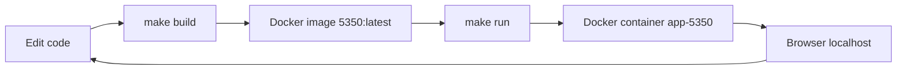
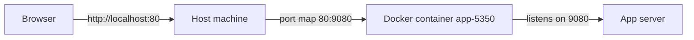
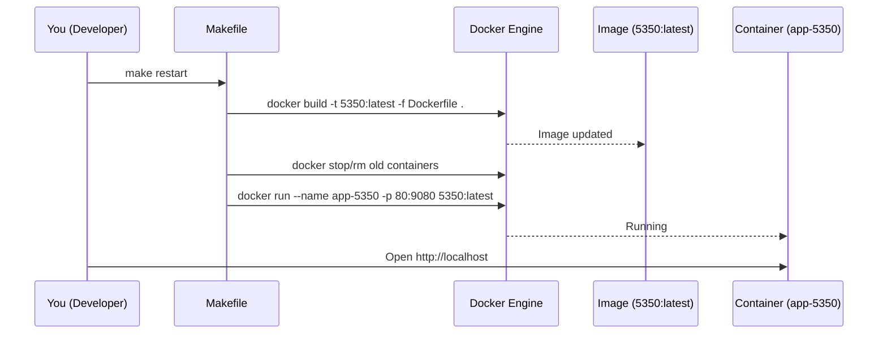

# Local App Development with Docker + Makefile (Student Guide)

Welcome! 👋  
This repo shows how to **build, run, stop, and restart** a local application using:

- **Docker** (Docker Desktop, Colima, or Linux Docker Engine)
- A **Makefile** to automate common tasks

This guide is written for **junior app developers**.

---

## Big picture



---

## Prerequisites

- Docker installed and running
  - macOS: Docker Desktop or Colima
  - Linux: Docker Engine
  - Windows: Docker Desktop (WSL2)
- Terminal access

Verify Docker works:
```bash
docker --version
docker info
```

---

## Key concepts (plain English)

### Image
An **image** is a packaged version of your app (code + runtime).
- Built from a Dockerfile
- In this repo, the default image name is: `5350:latest`

### Container
A **container** is a running instance of an image.
- In this repo, we run it as: `app-5350`

### Ports
- **Container port**: where the app listens *inside* the container (example: `9080`)
- **Host port**: where you access it on your machine (example: `80`)



---

## Files you’ll use

| File | Purpose |
|---|---|
| `Dockerfile` | Defines how the app image is built |
| `Makefile` | Automates build/run/stop tasks |
| `README.md` | This guide |

---

## Daily workflow (recommended)



---

## The commands you’ll use most

### 1) Build the image
```bash
make build
```

### 2) Run the app
```bash
make run
```

Open:
- `http://localhost`

### 3) Follow logs
```bash
make logs
```

### 4) Full reset (best default)
```bash
make restart
```

### 5) Stop and remove containers (free ports)
```bash
make clean
```

---

## Common errors & fixes

### “Ports are already allocated” / “Address already in use”
**Meaning:** Something else is using the host port (often another container or a local service).

Fix:
```bash
make clean
make run
```

Or use a different host port:
```bash
make run HOST_PORT=8080
```

### “Cannot connect to the Docker daemon”
**Meaning:** Docker isn’t running.

Fix:
- Start Docker Desktop / Colima
- Then retry `docker info`

---

## Tips for juniors

- Use `make restart` when you’re unsure. It rebuilds and runs cleanly.
- Use `make logs` when the app “runs” but the page doesn’t load.
- If you need to debug inside the container:
  ```bash
  make shell
  ```

---

## Optional: change ports / Dockerfile

Run on a different port:
```bash
make restart HOST_PORT=8080
```

Build with a different Dockerfile:
```bash
make build DOCKERFILE=Dockerfile.dev
```

---

Happy coding! 🚀  
This is the same basic workflow you’ll use on many engineering teams.
